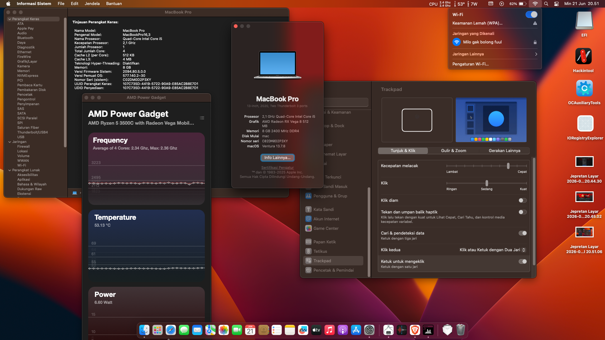

# Hackintosh pada Lenovo ThinkPad C13 Yoga Chromebook 

Proyek ini mendokumentasikan eksperimen pemasangan **macOS Sequoia** pada **Lenovo ThinkPad C13 Yoga Chromebook**. Perlu dicatat bahwa perangkat ini berbasis **AMD Ryzen 5 3500C (Picasso)**, yang secara teknis tidak didukung oleh Apple. Proyek ini bersifat eksperimental dan ditujukan untuk tujuan riset.

---

## 💻 Spesifikasi Hardware
- **Prosesor:** AMD Ryzen 5 3500C (Picasso)
- **RAM:** 8GB DDR4 (Soldered)
- **iGPU:** AMD Radeon Vega 8 (Mobile)
- **Penyimpanan:** 256GB SSD (FORESEE)
- **Wi-Fi/Bluetooth:** Intel AC 8265
- **Audio:** AMD Audio Coprocessor 
- **Layar:** 13.3" FHD Touchscreen
- **Bootloader:** OpenCore
- **OS:** macOS Sequoia 15.7.8

---

## ✅ Status Pekerjaan (Working)
*Fitur-fitur yang berhasil diimplementasikan:*

- [x] **Kernel:** Booting ke lingkungan Desktop (menggunakan `NootedRed`).
- [x] **Input:** Keyboard dan Trackpad (via `VoodooI2C` & `VoodooPS2`).
- [x] **Konektivitas:** Wi-Fi (via `AirportItlwm`).
- [x] **USB:** Deteksi port USB (Mapping `USBPorts.kext`).
- [x] **Tampilan:** Output dasar ke layar.

---

## ⚠️ Status Kendala (Known Issues)
*Fitur yang belum berfungsi optimal atau masih dalam tahap pengembangan:*

- [ ] **Akselerasi Grafis:** Dukungan Metal terbatas; animasi sistem mungkin terasa berat.
- [ ] **Power Management:** Fitur *Sleep/Wake* belum stabil; sering terjadi *freeze* saat transisi *sleep*.
- [ ] **Audio Internal:** Codec audio internal tidak terdeteksi secara native. *Solusi: Disarankan menggunakan USB Audio Dongle.*
- [ ] **Webcam:** Mengalami *crash* pada aplikasi seperti Photo Booth.

---

## 🛠️ Catatan Penting
Proyek ini **bukan ditujukan untuk penggunaan harian (*daily driver*)**. Karena keterbatasan arsitektur AMD APU pada Chromebook dan ketiadaan *driver* resmi dari Apple, sistem ini lebih cocok untuk tujuan pembelajaran dan riset teknis mengenai arsitektur sistem operasi.

## ⌨️ Pemetaan Keyboard & Shortcuts (Chromebook Layout)

Untuk mengoptimalkan penggunaan keyboard Chromebook di macOS, repositori ini menyertakan konfigurasi pemetaan tombol tingkat bootloader (**SSDT-PS2K**) dan konfigurasi **Karabiner-Elements** untuk shortcut Windows/ChromeOS-style:

### 1. Tata Letak Tombol Pengubah (Modifier Keys - SSDT-PS2K)
* **Ctrl (Control kiri)** tetap berfungsi sebagai **Control (⌃)**.
* **Alt (Sebelah kiri Spacebar)** dipetakan sebagai **Command (⌘)** (posisi natural Mac).
* **Search (Launcher/GUI key)** dipetakan sebagai **Option (⌥)**.

### 2. Konfigurasi Karabiner-Elements (`karabiner.json`)
Silakan pasang **Karabiner-Elements** di macOS dan gunakan konfigurasi yang disediakan untuk mengaktifkan pintasan berikut:

#### A. Navigasi & Penyuntingan Teks
* **Ctrl + Backspace** ➔ `Forward Delete` (Menghapus karakter di depan kursor)
* **Ctrl + Right Shift** ➔ `Caps Lock` (Menyalakan/mematikan Caps Lock - Toggle)
* **Ctrl + Left Arrow** ➔ `Home` (Pindah ke awal baris)
* **Ctrl + Right Arrow** ➔ `End` (Pindah ke akhir baris)
* **Ctrl + Up/Down Arrow** ➔ `Page Up` / `Page Down`
* **Ctrl + Alt + Backspace** ➔ `Cmd + Opt + Esc` (Force Quit)

#### B. Windows-Style Shortcuts (Aktif di semua aplikasi kecuali Terminal)
* **Ctrl + C** ➔ `Cmd + C` (Copy)
* **Ctrl + V** ➔ `Cmd + V` (Paste)
* **Ctrl + X** ➔ `Cmd + X` (Cut)
* **Ctrl + A** ➔ `Cmd + A` (Select All)
* **Ctrl + Z / Y** ➔ `Cmd + Z` / `Cmd + Y` (Undo / Redo)
* **Ctrl + S / F / T / W / N** ➔ Setara Command di macOS untuk Save, Find, New Tab, Close Tab, New Window.

#### C. Kombinasi Tombol F1-F12 (Ctrl + Baris Atas)
* **Ctrl + F1 / F2 / F3** ➔ Browser Back / Forward / Refresh
* **Ctrl + F4 / F5** ➔ Fullscreen Toggle / Mission Control
* **Ctrl + F6 / F7** ➔ Screen Brightness Down / Up
* **Ctrl + Alt + F6 / F7** ➔ Keyboard Backlight Down / Up
* **Ctrl + F8 / F9 / F10** ➔ Mute / Volume Down / Up
* **Ctrl + Shift + F4** ➔ Mirror Displays Toggle
* **Ctrl + Shift + F5** ➔ Screenshot area

---

## 🤝 Kontribusi
Jika Anda memiliki pengalaman dengan perangkat *codename* Morphius atau memiliki saran untuk optimasi SSDT/Kext, silakan buat *Pull Request* atau buka *Issue*. Setiap masukan sangat dihargai untuk pengembangan riset ini.

---

*Keep Hackintosh and Keep Hair Fall!* ☕
